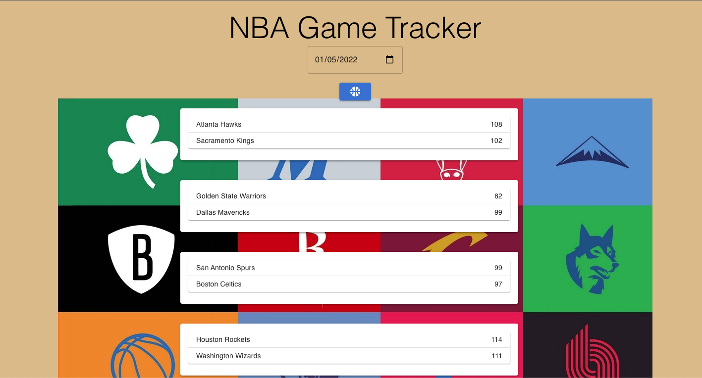
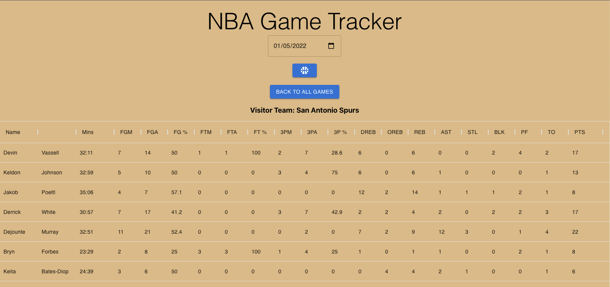
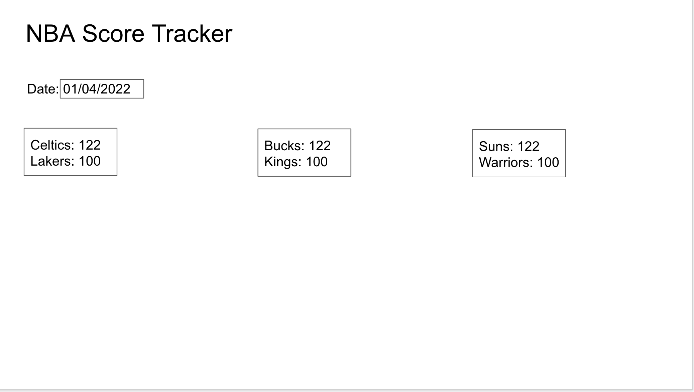
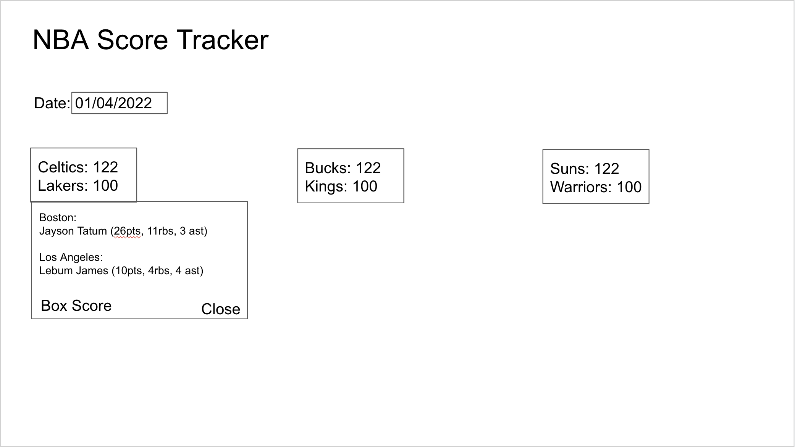
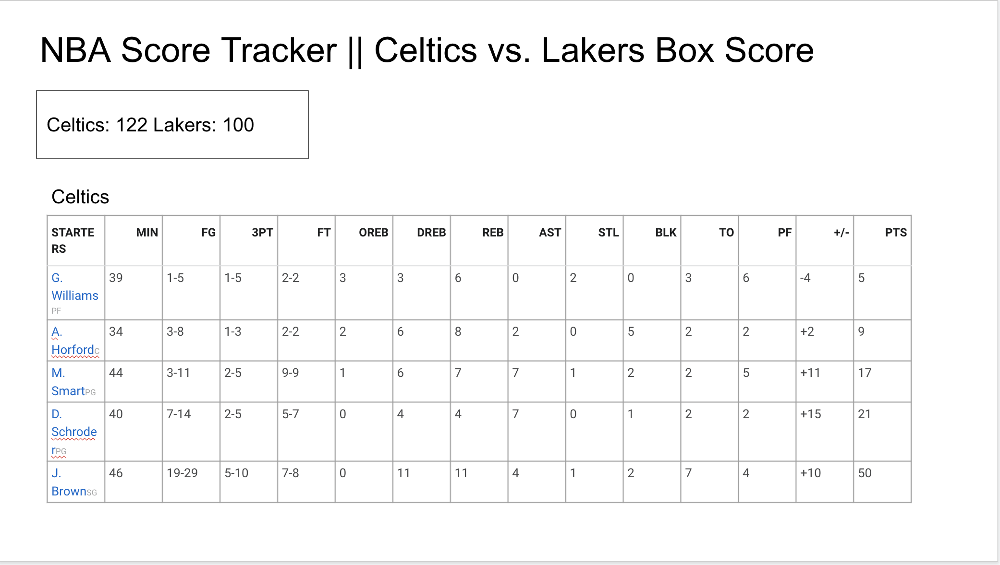

# **NBA Game Tracker ReadMe.md**

## **A React App that displays NBA scores and statistics from 1979 to current games. Big thank you to [BallDontLie](https://www.balldontlie.io/) api!**

#### **Once the user inputs a date, game cards are presented with games from that date.**

#### **When the user clicks on a game, they are redirected to the box score for that game that includes all player stats.**

## **List of the Technologies used**

- React
- Material UI Library

## **Installation instructions**

////////include instructions for cloning, and installing the dependencies. Then using npm start to start the server.

[Load](https://nbadashboard.netlify.app/) on your browser and start playing!

## **Your User stories – who are your users, what do they want and why?**

As a user, I want to be able to see all the NBA games from the date I selected.
As a user, I want to be able to select a game from the date I selected.
As a user, I want to be able to see the box score for the game I selected.
As a user, I want to be able to filter the players by the statistic I have selected.

#### **Your Wireframes – sketches of major views / interfaces in your application**

#### **Initial wireframe for the home page. Dynamic game cards were created once user inputted a date.**

#### **Initial wireframe for the game card. A dropdown was the original idea to display the game Goats (leading scorer, rebounder, assist) but based on the API structure, I did not want to overload it with too many requests.**

#### **Initial wire frame of the box score. Material UI gave the page a nice touch with the filterable columns.**

## **Descriptions of any Unsolved problems or major hurdles you had to overcome**

## **Major Hurdles:**

#### **Too many (?) API calls**

- The API I used allows 60 requests per minute, and while I wasn't really getting close to that, it felt like my application had an excessive need for a separate API call (based on the query syntax) -- after the user inputs the date, when the user chose a specific game, pulling all the players that played in a specific game

#### **Filtering through player data**

- The API returned player data for both teams, and it took a little help to use the game data from the initial API call to use the team as a filter constraint to target corresponding players.

#### **Constantly switching layouts to find the most suitable solution**

- Initially, I started to use FlexBox and switched over to CSS grid. It got very tedious styling, so I decided to source from Material UI's library using the Table component. It looked great, but I wanted the user to be able to sort each column, so I have to convert the data presentation to MUI's Data Grid.

## **Unsolved Problems:**

#### **Game GOATs**

- I want to be able to display the leading scorers, rebounders, assists for each team displayed, but with the structure of the API, the queries would need to happen on the user action (i.e. hover, dropdown click) so there would be a slight delay. If it so happens that the mouse is moving erratically on the screen, too many API requests could crash the app. I was thinking of using a UseEffect to render static data, but there is a slight worry about the effect user interaction may have on the presentation of the data. This would also require a function to compare all the players on the team and set the state for the highScorer, highRebounder, highAssist.

## **Future additions:**

#### **More mobile responsivity**

- Material UI's grid does not super responsive, even on window resizing. It does allow for scrolling on the box score, but not the most optimal view.

#### **Conditionally style game winners and star performances**

- colorize the text green for winners and star performances

#### **Render entire team rosters with season averages**

- This would require another API call, querying the season year, team name, and each individual player. Would probably need a function to calculate the statistical averages for each player, while accounting for missed games (0 would kill the averages)

#### **Create a search bar by teams/players**

- This would output the statistical averages for the team/player searched.
